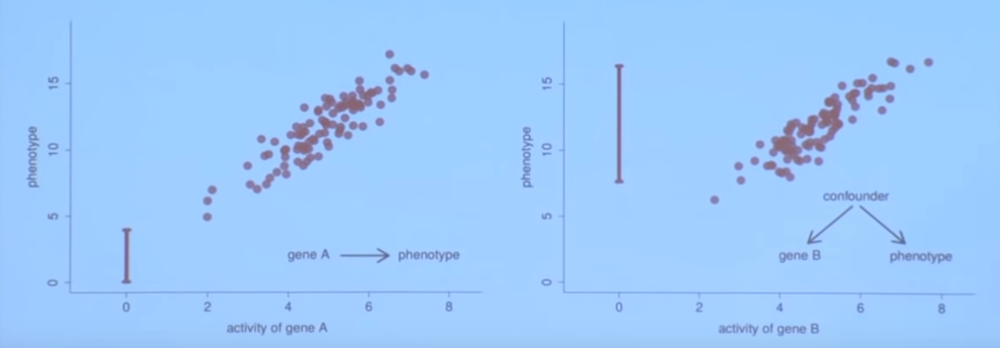
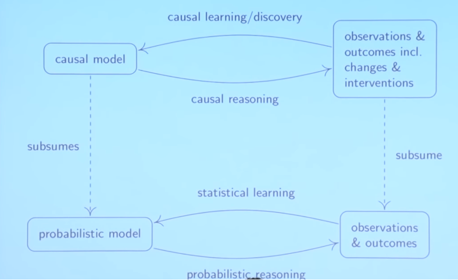
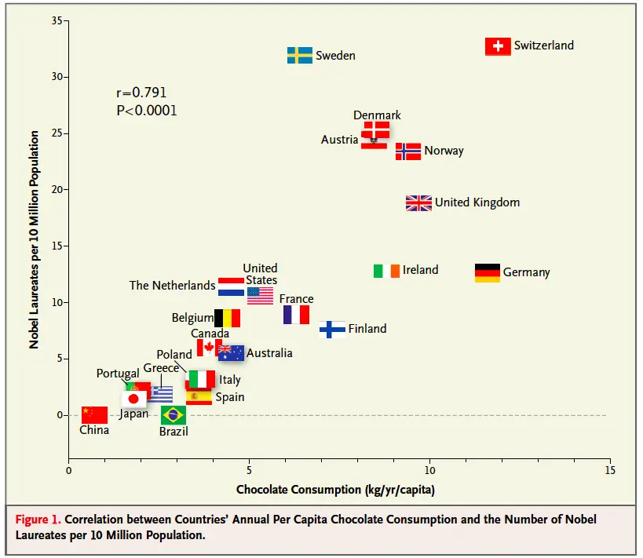
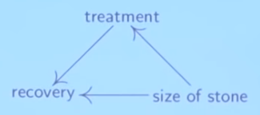

## Part 0 - Motivation

### Statistics vs Causality

In **statistics** we are often predicting the expected value of a dependent variable based on some observed valu1es of our inputs. In **causality** we are asking a different question of _"what happens if I actively change something in the system?"._ 

_YSK: A phenotype is term used in genetics for the composite observable traits of an organism._

We now consider two relationships between gene A, gene B and a phenotype. If gene A is really the causer of the phenotype, if we delete the gene A \(set the activity to zero\) we expect to see a change in the phenotype as well. On contrary, if gene B is not the causer for the phenotype but there is a hidden common causer for both gene B and the phenotype \(a.k.a. a confounder\), the best prediction for the phenotype when setting the activity of gene B to zero is to say that it will do as it always does, which is to stay within the range of observed values, so no change is expected in the phenotype caused by a change in gene B.

Be aware that we are now talking about **interventions** and not **observations** when talking about setting the genes activity to zero. We are actually actively deleting the gene B as opposed to observing a case.

### Learning and Reasoning

Overall, we talk about **learning** when we are building models based on data and **reasoning** when we are 

In the classical statistical setting, you start with a probabilistic model and then you can do some **probabilistic reasoning** \(e.g. if I get a sample what is the distribution of the mean\). In **statistical learning**, you go the other way around: when I get some observations, I want to infer some parameters about my probabilistic model.

In the other setting. when you are **causal reasoning** based on the causal model you not only make statements about observations but also about changes and interventions. When we are given some data, we want to infer something about the causal structure \(a.k.a. **structure learning**\).

There is some correspondence between the two settings but there is a major difference. Usually, in statistics you are often in the search for infinite number of data points; there's no point in estimating the mean if you can calculate based on the whole population, i.e. you are given the full distribution.  
In causality, even if you have an infinite amount of data points, the causal learning step does not become trivial because there is still the underlying problem of discovering the underlying causal structure. 

### What is a Causal Model?

Contrary to statistical models where we are just building a model for some distribution, on a **causal model** we will model several things at the same time:  
- **Distribution,** model the distribution that you observe \(e.g. data points\);  
- **Inverventional Distributions,** how the model reacts to interventions \(e.g. previous gene deletion\);  
- **Causal Graph**,  
- **Counterfactuals**, _what-if_ statements to be discussed later.

### Classical Examples of Non-Causality

#### Chocolate and Nobel Prizes

A known example of a strong correlation without a necessarily causal relationship is the relationship between countries per capita chocolate consumption and the number of Nobels per population. Assuming a causal relationship can lead to claiming things such as "Eating chocolate produces Nobel prize winners" or  "geniuses are more likely to eat lots of chocolate".

#### Kidney Stones

A clear example of how ignoring causality may lead to poor conclusions. Treatment A seems to be better both in small and large stones than Treatment B, but overall its total success rate is lower. Why? Because since Treatment A is expected to be better at dealing with difficult cases \(large stones\), its number of relative cases is biased towards those same difficult ones.

| Success Rate | Treatment A | Treatment B |
| :--- | :--- | :--- |
| Small Stones | 81/87 = 0.93 | 234/270 = 0.87 |
| Large Stones | 192/163 = 0.73 | 55/80 = 0.69 |
| **Total** | **273/350 = 0.78** | **289/350 = 0.83** |

As such, the size of the stone is a confounding factor of both the treatment \(e.g. larger stones will be more assigned towards Treatment A\) and the recovery \(e.g. larger stones have lower success rate\). The underlying question we are interested in is _"how the treatment influences the recovery?",_ i.e. the causal link between treatment and recovery. 

One example of intervention would be _"What is the expected recovery if all get Treatment B?"._

