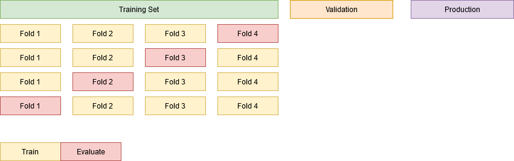
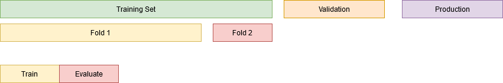
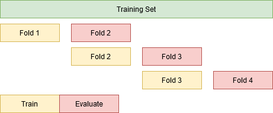
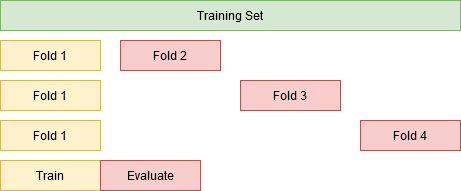
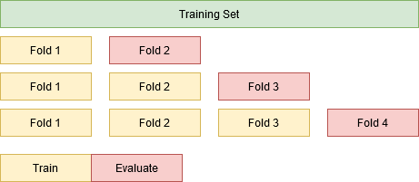
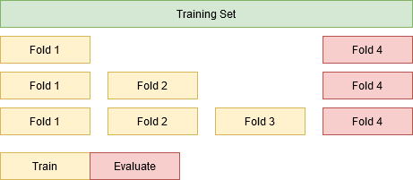

# Time Aware Cross-Validation
_How you can adapt the concept of cross-validation to extract insights about your time sensitive data._

_Disclaimer: I firstly wrote this post on Medium, available [here](https://medium.com/@urbanofonseca)._

In this article we present a high-level overview of the Cross-Validation technique and how we can adapt it to time sensitive data. These techniques are not novel and may be found in existing literature. The goal here is to present them in a comprehensible, intuitive and concise way.

## Estimating Performance
> Estimating generalization performance is a crucial step when training and deploying machine learning models. The ultimate goal of a Data Scientist is to build data pipelines and train machine learning models that are able to generalize and achieve good, consistent results in production. 

On a typical real-life scenario, we have 3 sources of data (with corresponding availability at training stage):
1. Training, used to train and optimize the model, available;
2. Validation, typically as holdout from source 1., used to estimate deployment performance, available;
3. Production, which you do not see until model is deployed, not available.

We are focused on achieving the best performance possible during the training stage without loss of generalization ability; maximising performance on the Training set and keeping such performance on Validation and (hopefully) in Production.

Thus, it's key to understand how the model behaves on those multiple stages, making sure that our model didn't overfit to the training data and it's still able to predict correctly in Production. One common technique to estimate such model's ability to generalize is Cross-Validation.

---

## Classical Setting
Cross validation is a standard resampling technique used to estimate the generalization performance of a machine learning model under a size-constrained dataset. By splitting the dataset into several folds (i.e. chunks) of data, we can iteratively leave one fold out, train with the remaining folds and evaluate the performance on the out-of-sample fold. Such process is commonly known as **K-Fold Cross-Validation**, where the K stands for the number of folds.

You can think of the simpler **Train/Test Split** as K-Fold with K=2.

Applying the K-Fold will give us K samples of the performance metrics (e.g. Recall, Precision), for which we can not only calculate their typical behaviour (e.g. mean, median) but also their variability (e.g. standard deviation). 

> Depending on the context, choosing which models go into production can be decided based on their stability (i.e. low variability of K-Fold scores), rather than in their absolute performance (i.e. higher mean).

---

## Measuring Cross-Validation
A good Cross-Validation setup should provide a good estimation of the generalization performance on both the Validation and the Production datasets. **Validation Performance** can be defined as evaluating the model on data never yet seen but available at the training stage. Ideally, it should provide an unbiased estimation of our generalization ability. As such, if we observe very different results between the _Validation Performance_ and the _Cross-Validation Performance_, we need to reassess our reliance on the in-training performance estimation technique (i.e. Cross-Validation).

---

## Time Sensitive Data
> One key disadvantage of using K-Fold Cross-Validation is its inadequacy to measure performance on time sensitive data, since training with the future and evaluating in the past may lead us to be overconfident on our predicting capabilities.

We say data is **time sensitive** when its characteristics (e.g. values, patterns) are directly connected to the passage of time. Common examples are stock prices, sensor data monitoring or fraud detection. 

_Example: it is easy to say that a sensor will be flawed or a stock price will increase in the future if we already saw that in the data._

We will consider one golden rule for measuring performance with time sensitive data: **train with the past, evaluate on the future**. This simple heuristic prevent us from overconfidently estimate the generalization capability of our model.

Despite not being able to use the classical K-Fold Cross-Validation, there are some variants of Cross-Validation, here presented as **Time Aware Cross-Validation** techniques, that allow to leverage the concept of subsetting the training data to better estimate generalization performance of our model.

We will discard our Validation and Production datasets for now since we will focus on estimating the performance based on the Training dataset.

---

## Insight #1 - Time Sensitivity
One key aspect to estimate generalization performance in time sensitive data is to understand how changes in time alone can impact the performance of our model. If we face **concept drift**, i.e. the underlying relationship between the inputs and outputs shifts along time, we may observe different performance metrics from models training with the same training and validation set sizes which are just shifted forwards throughout time.

---

## Insight #2 -Model Decay
When dealing with time sensitive data we can observe that the patterns used for the training stage may not be applicable for predicting in the future. In such occasions, we will observe **model decay** meaning that the performance of our model will degrade over time, leading to ever-decreasing performances in subsequent folds. 

---

## Insight #3 -Impact of Training set size
Depending on performances of the model you have estimated with the previous insights, you may need to use different alternatives for this one. The underlying exercise here is to evaluate how increasing the training set size impacts the performance of the model.

### Insight #3.1
_Approach with caution if the model performance is highly sensitive to time (cf. Insight #1)._

In this alternative, we increase the dataset training size to include one more fold at each step and evaluate on the next fold. _Example: Train(Fold1) & Evaluate(Fold2), Train(Fold1+Fold2) & Evaluate(Fold3) and so forth._

### Insight #3.2
_Approach with caution if the model performance has severe decay (cf. Insight #2)_

One major problem with the previous approach is that we are comparing performances based on different data (i.e. different evaluation folds) at each step. This does not allow us to understand what is the impact of increasing the dataset size for predicting in the same data.

As such, for this insight we will fix the evaluation fold and iteratively increase the training set size. We will now compete under the same rules, i.e. same evaluation data fold, but the model decay may now impact our predictions.

---

## Conclusions
We presented the concept of **Cross-Validation**, specifically the **K-Fold Cross-Validation**, **time sensitive data** and their incompatibility. To enable Cross-Validation with temporal data, we describe 3 main insights along with their applicability to better estimate and understand model  generalization performance. 

> No insight is unequivocally better/preferable than the others (since they serve different purposes) and they all should be analysed in a bundle.
